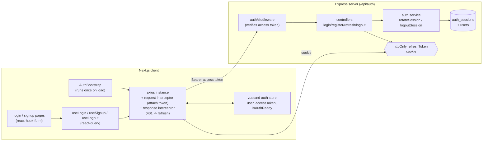
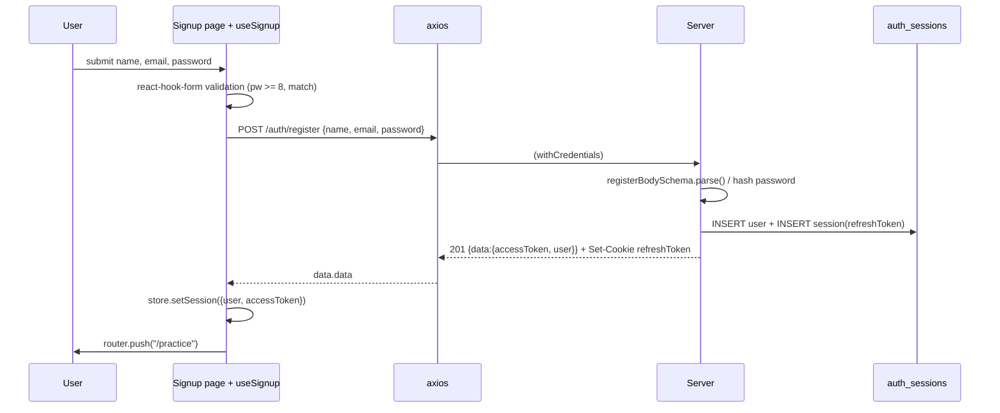
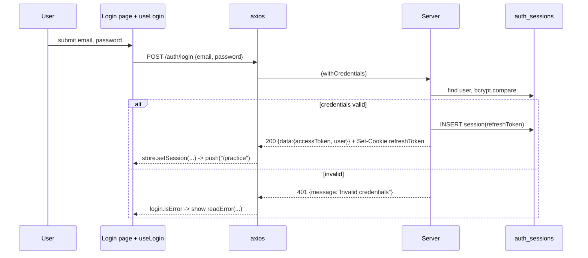
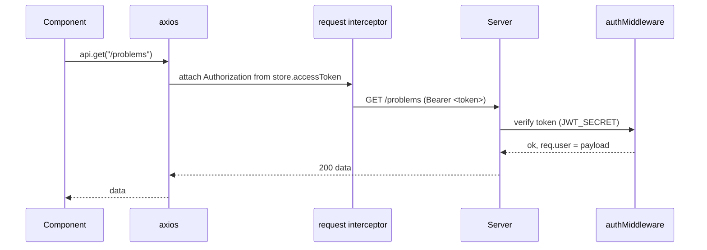
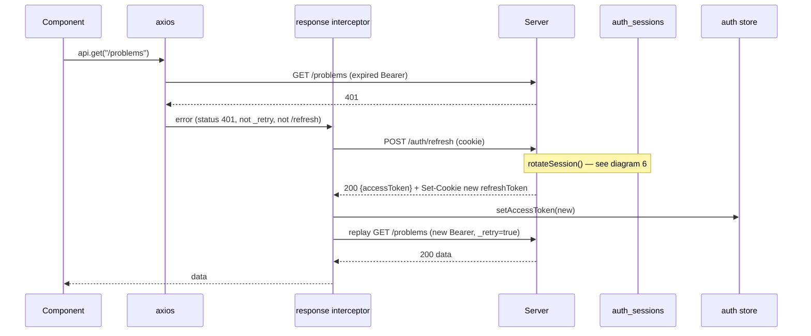
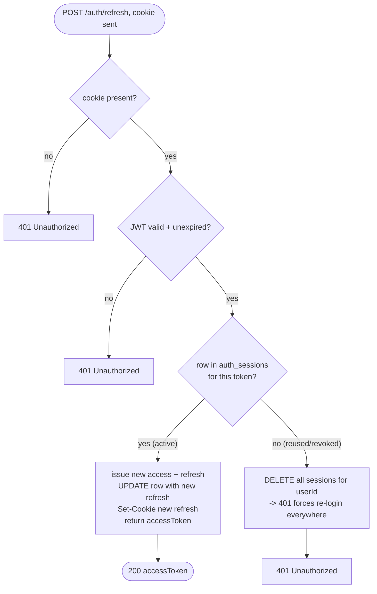
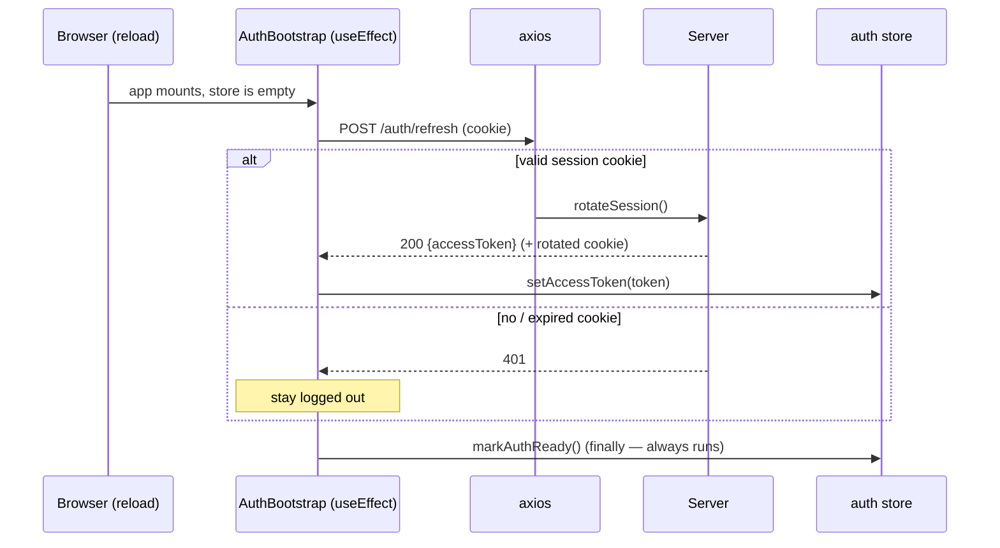
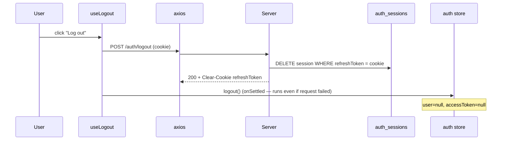

# Authentication Flows

End-to-end auth design across the Next.js client and the Express server.
Open this in VS Code's Markdown preview (`Ctrl+Shift+V`) to render the diagrams.

## Token model at a glance

| Token | Lifetime | Stored where | Readable by JS? | Purpose |
|-------|----------|--------------|-----------------|---------|
| **Access token** | 15 min | zustand store (memory only) | yes | Sent as `Authorization: Bearer` on every request |
| **Refresh token** | 7 days | httpOnly cookie **+** `auth_sessions` row | no (httpOnly) | Mints new access tokens; rotated on each use |

Key idea: the cookie alone isn't enough — refresh is **stateful**, so a refresh
token only works while a matching `auth_sessions` row exists. That row is what
makes logout and revocation real.

---

## 1. Component map

---

## 2. Signup  →  `POST /api/auth/register`

> `name` is validated but **not persisted** — the `users` table has no name column yet.

---

## 3. Login  →  `POST /api/auth/login`

---

## 4. Protected request with a VALID access token

The request interceptor attaches the token automatically — call sites never set the header.

---

## 5. Protected request with an EXPIRED access token (auto-refresh + retry)

This is the response interceptor doing its job transparently.

Guards that prevent loops:
- `original._retry` ensures **one** retry only.
- requests to `/auth/refresh` are skipped (a 401 there is a real failure).

---

## 6. Refresh with rotation  →  `POST /api/auth/refresh`

Why the "no row" branch nukes everything: a validly-signed token that isn't in
the DB means it was already rotated away (or revoked). Seeing it again is a
reuse signal, so every session for that user is dropped as a precaution.

---

## 7. App load / hard reload  (AuthBootstrap restores the session)

The access token lives only in memory, so a reload loses it — but the cookie survives.

> Limitation: `/auth/refresh` returns only an access token, so `user` stays
> `null` after reload. Add a `/auth/me` endpoint and fetch it here to fully
> restore the user object. Guarded pages should wait on `isAuthReady`.

---

## 8. Logout  →  `POST /api/auth/logout`

After this the refresh token is gone from both the cookie and the DB, so it can
never mint another access token — that's the payoff of the stateful design.

---

## 9. Scenario summary

| Scenario | Trigger | Result |
|----------|---------|--------|
| Signup | valid form | user created, session started, redirected |
| Login OK | right credentials | session started, token in store |
| Login bad | wrong credentials | 401, inline error |
| Protected call (valid) | token fresh | 200 |
| Protected call (expired) | token expired | silent refresh + retry, 200 |
| Refresh OK | active session cookie | new access token, rotated refresh |
| Refresh reused/revoked | token not in DB | 401, **all** user sessions wiped |
| Refresh missing/expired | no/invalid cookie | 401 |
| Reload | page refresh | session restored from cookie (user still null) |
| Logout | user action | DB row deleted, cookie cleared, store cleared |
